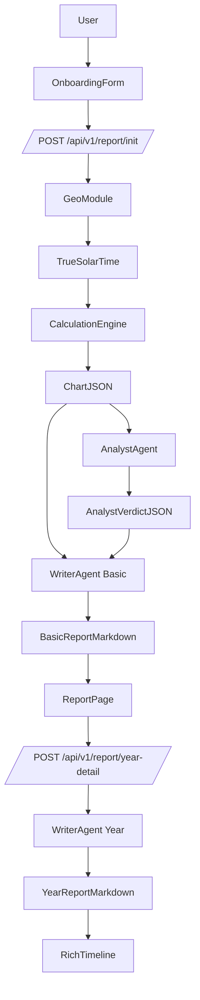

# AI 八字终身蓝图平台：分层架构与迭代实施计划（Node.js + Next.js）

## 总体架构概览

- **整体技术栈**
  - **前端**: Next.js（App Router, TypeScript, Tailwind/Chakra 任选其一）
  - **后端/API**: Next.js 内置 API Route 或独立 Node/TypeScript 服务（建议：先用 Next API，后期可抽离）
  - **Bazi 计算层**: Node.js + `bazi-js`（或自定义模块封装），严格单元测试
  - **AI Agent 调用**: 后端通过统一 `LLMClient` 封装，支持 GPT-4o / Claude 3.5 Sonnet 等
  - **存储**: 基础版本仅使用浏览器 `localStorage` 做最近 5 个 Profile 记录；后续可扩展数据库

- **三层逻辑映射到代码结构**
  - **Layer 1 - Calculation Engine (Deterministic)**
    - `backend/bazi/calculationEngine.ts`
    - `backend/bazi/solarTime.ts`（真太阳时 + 地理位置转换）
    - 输出标准化 `ChartJSON` 类型
  - **Layer 2 - Analyst Agent (Logic LLM)**
    - `backend/agents/analystAgent.ts`
    - 输入 `ChartJSON`，输出 `AnalystVerdictJSON`
  - **Layer 3 - Writer Agent (Creative LLM)**
    - `backend/agents/writerAgent.ts`
    - 输入 `ChartJSON + AnalystVerdictJSON + Context(报告类型/年份)`，输出 Markdown 文本（简体中文）

- **关键数据结构（TypeScript 接口层面定义）**
  - `types/bazi.ts`: `FourPillars`, `LuckPillar`, `InteractionMatrix`, `StarGod`, `ChartJSON`
  - `types/analyst.ts`: `DayMasterStrength`, `ChartStructure`, `AnalystVerdictJSON`
  - `types/report.ts`: 基础报告/年度报告的 Markdown & 元数据结构

- **高层数据流（Mermaid）**

---

## 阶段 1：项目骨架与基础工具

- **目标**: 建立可运行的 Next.js + TypeScript 项目骨架，配置基础代码质量、测试框架，为后续 TDD 奠定基础。

- **主要文件与模块**
  - `package.json`: 脚本命令（dev/test/lint/build）
  - `next.config.mjs`: 基础配置
  - `tsconfig.json`: 严格类型检查
  - `jest.config.ts` 或 `vitest.config.ts`: 单元测试配置
  - `.eslintrc.cjs`, `.prettierrc`: 代码规范

- **子步骤**

  1. 初始化 Next.js 项目（TypeScript 模板），安装依赖（React, Next, TS）
  2. 配置 ESLint + Prettier + Husky（可选）
  3. 选择测试框架（Jest 或 Vitest），配置运行脚本
  4. 简单 Hello World 页面与一个示例 API Route，确保本地运行 & 测试通过

---

## 阶段 2：领域类型建模（Bazi/报告核心类型）

- **目标**: 在不实现具体计算逻辑前，先用 TypeScript 建立清晰的数据类型与接口，保证三层之间的数据契约稳定。

- **主要文件**
  - `types/bazi.ts`
  - `types/analyst.ts`
  - `types/report.ts`

- **子步骤**

  1. 定义四柱、藏干、十神、运柱等基础枚举与类型（尽可能语义化命名，中文注释）
  2. 定义 `ChartJSON` 接口，覆盖规范中的所有字段
  3. 定义 `AnalystVerdictJSON` 接口（结构、用神、忌神、推理说明）
  4. 定义基础报告、年度报告的 Markdown + 元数据结构
  5. 为类型定义编写类型级“测试”（利用 `tsd` 或在单测中做类型断言）

---

## 阶段 3：真太阳时与地理模块（Geo + Solar Time）

- **目标**: 抽象出与第三方地理 API 解耦的真太阳时模块，便于替换 Google Places/Mapbox 等实现；提供可测试的核心算法。

- **主要文件**
  - `backend/geo/geoTypes.ts`: 城市查询与坐标类型
  - `backend/geo/geoClient.ts`: 地理 API 抽象接口 + mock 实现
  - `backend/bazi/solarTime.ts`: 真太阳时计算核心

- **子步骤**

  1. 设计 `GeoClient` 接口（如 `searchCity(name)`, `getCoordinates(placeId)`）
  2. 提供一个 `InMemoryGeoClient` 或 Fake 实现用于本地开发与测试
  3. 在 `solarTime.ts` 中实现 “城市 -> 经度 -> 校正时间” 的计算流程（先用简化公式 + TODO 标记，以后可精细化）
  4. 编写单元测试：

     - 给定经度与本地时间，输出预期的真太阳时（使用固定样例，避免依赖真实 API）
     - Geocoding 失败时，返回 fallback 并附带标记

---

## 阶段 4：Layer 1 计算引擎（Deterministic Calculation Engine）

- **目标**: 封装八字盘排盘逻辑（可基于 `bazi-js`），输出规范化 `ChartJSON`，完全独立于 AI。

- **主要文件**
  - `backend/bazi/calculationEngine.ts`
  - `backend/bazi/interactionMatrix.ts`
  - `backend/bazi/starGods.ts`

- **子步骤**

  1. 封装 `calculateChart(input: BirthInput & LocationInfo): ChartJSON` 主入口函数
  2. 适配/包装 `bazi-js`（或内部实现）以生成四柱、藏干
  3. 实现 10 年大运推算模块，返回有序 `LuckPillar[]`
  4. 实现冲/合/刑/害等 Interaction Matrix 的计算逻辑
  5. 实现常用神煞（Shen Sha）标记（可先支持一部分常见神煞，后续扩展）
  6. 按规范编写单元测试：

     - 至少 20 个日期样本与万年历对照（可用 JSON fixture 模拟）
     - 覆盖日主天干、四柱、运柱、节气边界等边缘案例

---

## 阶段 5：Layer 2 分析 Agent（Analyst Agent）

- **目标**: 将 LLM 调用逻辑与领域规则封装在 `analystAgent` 中，仅消费 `ChartJSON` 并输出 `AnalystVerdictJSON`，不做任何再排盘。

- **主要文件**
  - `backend/llm/llmClient.ts`: 通用 LLM 客户端封装
  - `backend/agents/analystAgent.ts`
  - `backend/agents/prompts/analystSystemPrompt.txt`

- **子步骤**

  1. 定义 `LLMClient` 接口（支持 streaming/非 streaming，后续可扩展多模型）
  2. 为 Analyst Agent 编写系统提示词与 few-shot 示例（专注于结构判断、用神判断）
  3. 实现 `analyzeChart(chart: ChartJSON): Promise<AnalystVerdictJSON>`
  4. 在测试中使用 mock LLMClient（固定 response），确保解析 JSON 严格、安全（加 JSON schema 校验）

---

## 阶段 6：Layer 3 写作 Agent（Writer Agent）

- **目标**: 将 LLM 作为“笔”，从 `ChartJSON + AnalystVerdictJSON` 生成结构化 Markdown 文本（简体中文），支持基础报告与年度报告两种模式。

- **主要文件**
  - `backend/agents/writerAgent.ts`
  - `backend/agents/prompts/writerSystemPrompt_basic.txt`
  - `backend/agents/prompts/writerSystemPrompt_yearDetail.txt`

- **子步骤**

  1. 设计 Writer 的系统提示词，明确：

     - 只允许使用 Analyst 提供的技术结论
     - 不得自行推算命盘
     - 不得给出死亡、医疗、投资等敏感结论

  1. 实现 `generateBasicReport(chart, verdict): Promise<BasicReport>`
  2. 实现 `generateYearDetail(chart, verdict, year): Promise<YearReport>`
  3. 使用 mock LLMClient 做单元测试，确保 Markdown 结构、分段、语气（建设性、教学向）符合预期

---

## 阶段 7：API 设计与实现（/api/v1/report/init & /year-detail）

- **目标**: 根据规格实现两个核心 API，串联三层逻辑，确保返回结构稳定、错误处理清晰。

- **主要文件**
  - `app/api/v1/report/init/route.ts`
  - `app/api/v1/report/year-detail/route.ts`
  - `backend/api/validators.ts`: 输入校验
  - `backend/api/mappers.ts`: 将内部结构映射为前端友好格式

- **子步骤**

  1. 定义 `BirthInput` 请求体 Schema（Zod/Yup 等）
  2. 在 `/init` 中串联：Geo -> SolarTime -> CalculationEngine -> AnalystAgent -> Writer Basic
  3. 在 `/year-detail` 中串联：接收已有 ChartJSON + 年份 -> Writer YearDetail
  4. 实现错误处理与返回码：

     - Geocoding 失败：fallback + "True Solar Time not applied" 提示字段
     - LLM 调用失败：友好错误信息 + 可重试标记

  1. 为两个 API 编写集成测试（使用 mock LLM & mock GeoClient）

---

## 阶段 8：前端 Onboarding & Profile 管理（localStorage）

- **目标**: 提供简洁的用户输入流程与最近 5 个命盘的本地历史管理，无需登录。

- **主要文件**
  - `app/page.tsx` 或 `app/(public)/onboarding/page.tsx`
  - `components/forms/BirthForm.tsx`
  - `lib/storage/profileStorage.ts`

- **子步骤**

  1. 设计并实现表单 UI：姓名（可选）、性别、出生日期、出生时间、出生城市（自动完成输入框）
  2. 实现 `profileStorage` 模块：

     - 保存最近 5 条 profile（带时间戳）到 `localStorage`
     - 提供获取、更新、删除接口

  1. 实现历史下拉选择器组件，支持快速切换不同命盘
  2. 与 `/api/v1/report/init` 对接，提交后展示报告页

---

## 阶段 9：报告展示 UI（Sticky Header + Technical Card）

- **目标**: 构建满足“玻璃盒子”要求的报告页面，含桌面端 Four Pillars Sticky Header、移动端简化栏、技术卡片等。

- **主要文件**
  - `app/report/page.tsx` 或基于路由 `app/report/[profileId]/page.tsx`
  - `components